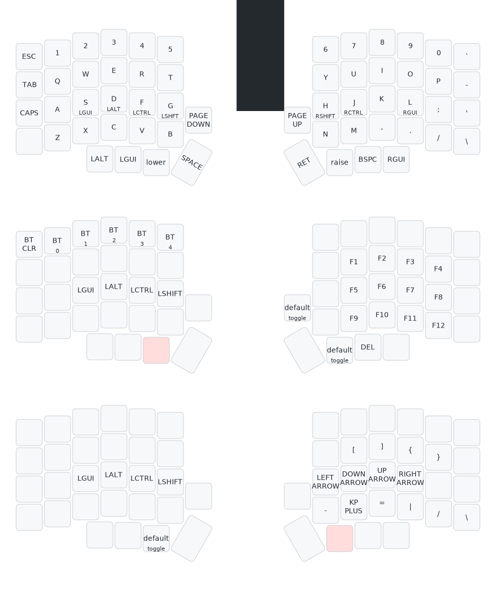

# ZMK Keyboard Configurations

Uses [zmk-nix][zmk-nix].

## Usage

```bash
nix build .#lily58
# or
nix build .#taira
```

Then flash contents of `result/`

## Keyboards

### [Lily58][./keyboards/lily58/]

My configuration based on what was [included in ZMK][lily58-cfg].



### [taira][./keyboards/taira/]

Configuration for the [taira keyboard][taira-keyboard] adopted from the [original source][taira-cfg].

All the unmodified source files taken from the [taira configuration][taira-cfg] have a comment indicating original attribution on top. I am **not** the author of any code in those.

[zmk-nix]: https://github.com/lilyinstarlight/zmk-nix
[lily58-keyboard]: https://github.com/kata0510/Lily58
[lily58-cfg]: https://github.com/zmkfirmware/zmk/tree/main/app/boards/shields/lily58
[taira-keyboard]: https://github.com/strayer/taira-keyboard
[taira-cfg]: https://github.com/strayer/taira-keyboard-zmk-config
